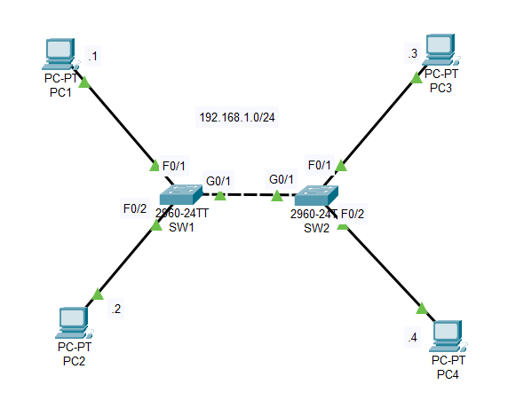

## Day 06 – Ethernet LAN Switching
**Topic:** Switch operations  
**Summary:**  
- Observed MAC address learning process of a switch  
- Tested switching with ping and traffic flow  
**Learned:** How switches forward frames based on MAC tables.
  
