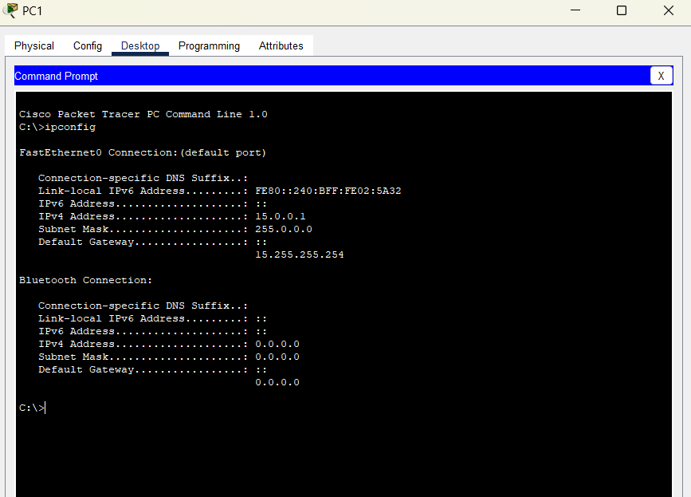

## Day 08 – IPv4 Addresses
**Topic:** Addressing & subnetting  
**Summary:**  
- Assigned IPv4 addresses to PCs and router interfaces  
- Tested communication using ping  
**Learned:** Importance of correct IP, mask, and gateway configuration.

---
